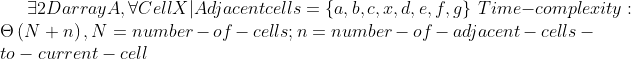
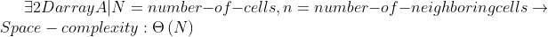

# Project Title: Minesweeper

## Team Members:
- Cedric Murairi
- Mthabisi Ndlovu
- Samuel Anumudu

## Data Structure and Algorithm used:
- Data Structure: 2D arrays and single arrays
    - These Data Structures are used to store cell location on the screen and build up the board game. We used two dimensions arrays to come up with rows, columns, and individual cells for the Game.

- Algorithm: Depth First Search Algorithm
    - The algorithm plays a critical part in playing the game; given that each time a user clicks a cell, it get revealed if it is empty or displays the number of mined cells around,.We chose to use Depth First Search since you need to check every adjacent cell to the current cell if they got mines; if not, you do it recursively until you find mined cells around. And that's for each cell, starting from the one that got clicked.

## Project Description:
Minesweeper is a single-player puzzle video game. The game's objective is to clear a rectangular board containing hidden "mines" or bombs without detonating any of them, with help from clues about the number of neighboring mines in each field. The game originates from the 1960s, and it has been written for many computing platforms in use today. It has many variations and offshoots.

Some Minesweeper versions will set up the board by never placing a mine on the first square revealed. However, our version will have a mine in the first square in some cases since the pattern is random.

If a square containing a mine is revealed, the player loses the game. If no mine is revealed, a digit is instead displayed in the square, indicating how many adjacent squares contain mines; if no mines are adjacent, the square becomes blank, and all adjacent squares will be recursively revealed. The player uses this information to deduce the contents of other squares and may either safely reveal each square or mark the square as containing a mine.

There is only one life for the entire game, so you die once you hit the wrong spot. And the only way to win is to reveal all the empty squares or cells successfully

## Project Motivation:
This project is the sole purpose to play around with search algorithm, in this case being the "Depth First Search Algorithm". And we found out that Minesweeper would be a great fit to illustrate this, however, dealing with arrays, not trees or graphs.

It is an algorithm for exploring a graph, a tree, or another data structure systematically. In a depth-first search, you go as far in any direction you can before backtracking and trying a different approach.
To traverse or search this tree using depth-first search, you start at the top. You then go left until you hit a place where you must choose, and then again, you take the left branch. If you find no paths are branching off a node, then you backtrack and then go right. You do this until you achieve your goal.

However, Minesweeper does not have anything that looks like a tree. It turns out you can still use depth-first search when revealing squares after a player's click. When the player clicks on a square with no mines nearby, we reveal that square. Then we check to see if the square above it has any mines nearby. If it does not, we check the square above that one and so on until we find a square with mines nearby. After we find a square with mines nearby, we check all of its neighbors (upper right, right, lower right…) going clockwise until we find a neighbor without any mines nearby (value 0) and then making that one my current focus.

## Solution
Minesweeper is a single-player puzzle video game. The game's objective is to clear a rectangular board containing hidden "mines" or bombs without detonating any of them, with help from clues about the number of neighboring mines in each field. The game originates from the 1960s, and it has been written for many computing platforms in use today. It has many variations and offshoots.
The Solution we are providing in this game is to enhance critical thinking and usage of clues or hints to conclude that saves us time and resources.
E achieved this through the spirit of the game; you click a cell or square, and you are told how many mines are around. If you hit a mined cell, you die; otherwise, you get more clues until you reveal all the empty cells. So technically, this game helps us learn how to handle risk and not fear it but take it as an opportunity toward success.

[**You can check this link for our video presentation:**](https://drive.google.com/file/d/1Os0hDvuG436YRZtnx6_ry26Yzzn0GwtN/view?usp=sharing)

## Correctness of Algorithm
In our project Minesweeper, we are using the **Depth First Search Algorithm** to come up with the working application, which helps closely in mined cells location. Here, we are going to check the correctness of that Algorithm and how we customized it for Arrays; remember it is commonly used for Trees and Graphs.

We are going to take a closer look a the Depth First Search which is implementes using two functions: `reveal()` and `find_neighbours()` that respectively reveal a cell or square once it is clicked and find the neighbouring cells or squares of the clicked one.

### Find neighbours function:

```Python
def find_neighbours(self):
        
        neighbors = []
        x_max = self.x + 20 if self.x + 20 < self.board.h else self.x
        x_min = self.x - 20 if self.x - 20 >= 0 else self.x
        y_max = self.y + 20 if self.y + 20 < self.board.h else self.y
        y_min = self.y - 20 if self.y - 20 >= 0 else self.y

        for i in range(x_min, x_max + 1, 20):
            for j in range(y_min, y_max + 1, 20):
                if i != self.x or j != self.y:  # DeMorgan's 1st Law: negating conjuctions
                    neighbors.append([i, j])

        return neighbors
```
From the code above, we can see that the function is correct since each time the process is called, the following happens:
- It first declares an empty array to hold all the neighboring cells that will be found during the process since every cell should have at least one neighbor
- Next, the function sets the max value of x to make sure it does not go beyond the board, which is the board heigh or width; otherwise, it sets it to the value
- Next up, the function sets the min value for x and the max value for y, the min value for y using the same procedure and constraints as x coordinates.
- After, the function checks all the cells surrounding the current cell using a double loop skipping 20 since it is the size of the cell or square. Each square or cell starts 20 px after the origin of the previous.
The function checks for each iteration if the coordinates of the current cell are different from the current I and J value to avoid adding the cell as its neighbor. After which the function will add the coordinates of the neighboring cell to the array `neighbors`
- When the loop is completed, the neighbors' array will get returned and used by the reveal function; we can see that the process is correct with what it is doing.
Let us now look at the reveal function that uses the return statement from this function and perform the Depth First Search Algorithm.

### Reveal function:

```Python
def reveal(self):
        if(self.status == 1):
            self.colour = '#212121'
            self.board.end_game()
            
        elif(self.status == 0):
            if(self.revealed):
                return
            else:
                self.colour = '#AED581'
                self.revealed = True
                neighbours = self.find_neighbours()
                for coord in neighbours:
                    cell = self.board.get_cell(coord[0], coord[1])
                    if cell.status == 1:
                        self.mines += 1
                    else: continue
                
                if self.mines > 0:
                    return
                
                elif self.mines == 0:
                    for coord in neighbours:
                        cell = self.board.get_cell(coord[0], coord[1])
                        cell.reveal()
```
The reveal function is here making good use of the returned array from the `find_neighbors` function. Let us take a closer look at its correctness.
- First, the function checks the status of the cell and sets its color accordingly; status == 1 means the cell is mined, status == 0 means the cell is empty. Each time the cell is mined, the color is set to red, and the game ends. Otherwise, the function proceeds to the else statement.
- The else statement comes into play when the clicked cell or square is an empty one or does not contain any mines.
- If the cell is revealed to the user, we do not need to proceed, so the function will not execute any further.
- Otherwise, the cell color is changed to light green, and its revealed status is changed to true so that next time we don't waste time.
- Function proceeds to find the neighboring cells to the current cell and get an array of coordinates as a return statement.
- Now, pay close attention because the Search Algorithm comes into play from now going onward.
-Once we have the neighbors, the function loops over the coordinates, and for each set of coordinates, it checks if the cell is mined, aka if the cell `status == 1` and set the `mines count to + 1`; this `mines` variable keeps track of the number of mined cells around the current cell.
- If a neighbor cell isn't mined, aka `status == 0`; the loop ignores and goes to the next iteration.
- After registering all the mines around the current cell, the function checks the mines count for the cell; if it is greater than zero, the process stops and show the number on the screen
- Otherwise, the function continues, and since it is one, there are no mined cells around the current cell. The function uses recursion to check for all the adjacent cells to the current and reveal them, repeating the entire process from the beginning for all neighboring cells until mined are found.
- After all this overview of how the function performs, it is clear that the Functions and Algorithms used in the program perform very well, and it is correct overall.

## Efficiency of Algorithm
Here we are going to take a closer look into the analysis or efficiency of the Algorithm we used: Depth First Search.
- Time complexity:
The time compexity of this algorithm is Big O of N. TO usderstand this we should understand what happens when the algorithm does the searching. It goes from the current cell and checks all the others around; the number might go up to 8 cells. Note that the program does not check a cell if it is already checked and revealed, so each cell is checked exactly once; this leads to a time complexity of `Big O of (N + n)` for our Algorithm. `N` being the number of cells on our board and `n` being the number of neighbor cells to the current cell.

-  

- Space complexity:
From the variables we have in our algorithm implementation, we are stoing the neighboring cells in an array `neighbors` and store a returned cell in the variable `cell`. We can clearly see that the space occupied by the algorithm changes depending on the size of the array which happens to lead to a linear space complexity or `Big O of N`

- 


## How to run
If you want to run this application and test it on your local environment, here are few things you need to check off to get it up and running, it won't run if you do not follow the instructions:

### SetUp Development Environment
- This project uses Python Programming language with a Processing layer; you can learn more about [Processing](https://www.processing.org). With that in mind the first thing you need to do is have Python 3 or above installed on your machine.
- Next you need of course Processing itself and you can download it from [the official Processing site](https://www.processing.org/download/)
- Then you need to install the downloaded Processing application depending on your operating system
- After that, you need to open it up and install the Python Mode as shown in the picture bellow:


### Clone the repository on you local machine and get ready
- Make sure you are in processing and click File -> Open
- A window should open depending on your OS, leading you to your Finder or File Manager
- Make sure you navigate to the right location you cloned the repo
- Open the application folder and finally select Mineswepper.pyde
- If you followed all the steps above, this should bring you back to processing with the application code
- After that, what you need is to hit RUN and you should see the Game

## Bibliography/References:
- Processing Foundation, 2018. Processing Mode Installation--01. [image] Available at: <https://camo.githubusercontent.com/8154f4f84860569c2a4851c0ce187bd00cf89d0f477b94b2c30a01db40550954/687474703a2f2f70792e70726f63657373696e672e6f72672f6164645f6d6f64652e706e67> [Accessed 21 April 2021].
- Processing Foundation, 2018. Processing Python Mode Installation--02. [image] Available at: <https://camo.githubusercontent.com/108b2a67bcf6c78fca5d5e74afa18f2fa1f2aa7ff6de9a95693fd2be44bd8893/687474703a2f2f70792e70726f63657373696e672e6f72672f696e7374616c6c2e706e67> [Accessed 21 April 2021].
- En.wikipedia.org. 2021. Minesweeper (video game) - Wikipedia. [online] Available at: <https://en.wikipedia.org/wiki/Minesweeper_(video_game)> [Accessed 22 April 2021].